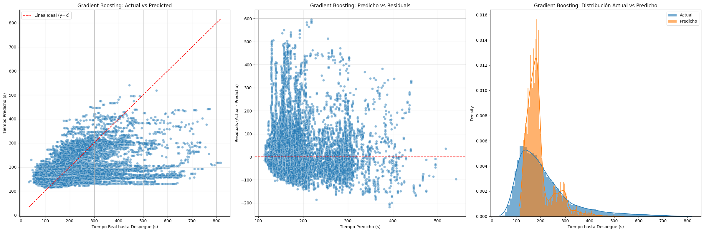

# Resultados y lectura de los experimentos

## Experimento destacado

Fuente: [`project/src/train/train._models.ipynb`](../project/src/train/train._models.ipynb), salidas guardadas de Gradient Boosting.

- MAE: 67.642121 segundos.
- RMSE: 104.077131 segundos.
- R²: 0.165905.
- Tamaños registrados tras el split: 47.590 observaciones de entrenamiento, 7.270 de validación y 13.249 de test.

El notebook contiene comparaciones de modelos y evaluación por pista, punto de espera y rango de tiempo real. El MAE varía considerablemente entre segmentos y crece en las esperas más largas. Un R² de 0,166 muestra una capacidad explicativa limitada en ese test.

Esta figura es la salida PNG de la segunda celda del notebook de referencia (primer output), extraída sin modificar. No se han regenerado las predicciones ni los resultados.

## Experimentos alternativos

[`train_models2.ipynb`](../project/src/train/train_models2.ipynb) documenta para Gradient Boosting MAE 67.627449, RMSE 104.778787 y R² 0.154621. Son valores de otro experimento y no deben combinarse con los del README.

Los notebooks `train_segmented*` exploran segmentaciones operativas y versiones con y sin valores atípicos. Un menor error sobre un conjunto filtrado no demuestra por sí solo una mejora sobre la población completa.

## Qué falta para una validación más sólida

- Reproducir los experimentos con versiones de dependencias y particiones documentadas.
- Comparar con una referencia sencilla sobre exactamente el mismo test.
- Revisar la separación temporal y por vuelo para evitar compartir información entre particiones.
- Calcular los umbrales de tratamiento de valores atípicos solo con entrenamiento: el script de limpieza original calcula cuantiles antes de separar los conjuntos.
- Reservar un test final independiente para evaluar la selección de modelos.

Los resultados se presentan como evidencia del trabajo académico y sus limitaciones, no como validación de un sistema operativo aeroportuario.
